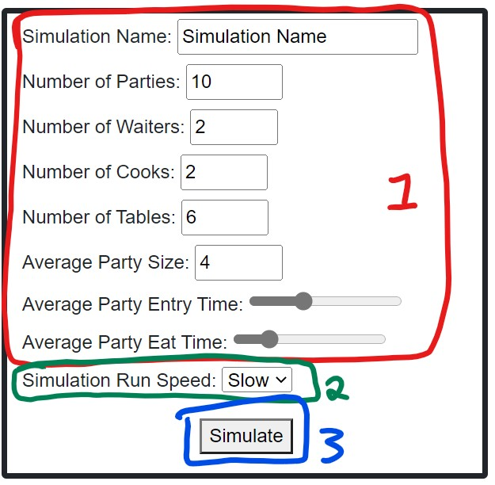

# Diner Simulation "SimulEAT"

* Run In Blazor Pages:
	* Build The DinerBlazorServer Project and run the .dll file
	* Enter Information into the form on the left:

1. (In Red): Enter arguements to change the results of the simulation
2. (In Green): Choose if the simulation will run fast or slow. 
	* If slow is chosen, the simulation takes one second per cycle and the simulation is displayed below.
	* If fast is chosen, the simulation takes 100 milliseconds per cycle and a progress bar is displayed below. 
3. (In Blue): Click to run the simulation!

* Run In Razor Pages:
	* Run the DockerCompose file

