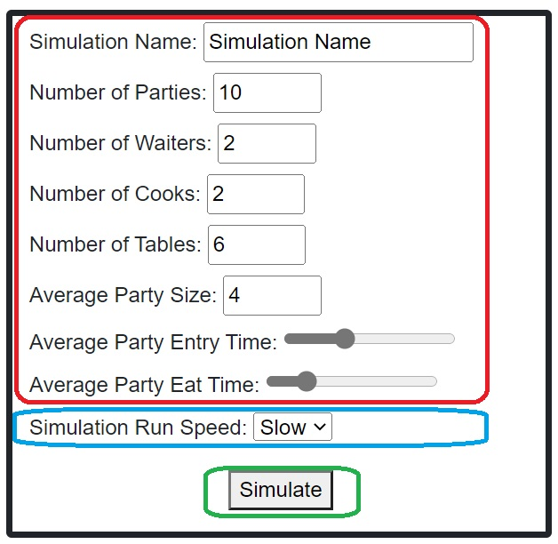

# Diner Simulation "SimulEAT"

* Run In Blazor Pages:
	* Build The DinerBlazorServer Project and run the .dll file
	* Enter Information into the form on the left:
	
	
* Run In Razor Pages:
	* Run the DockerCompose file

